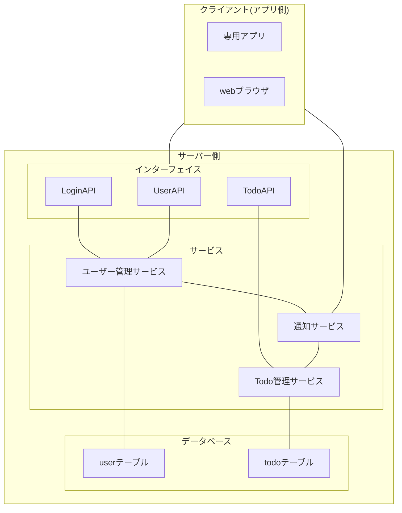
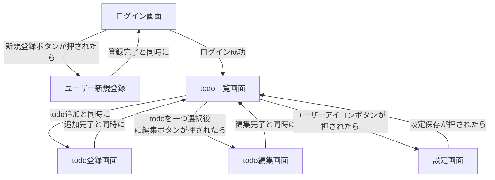
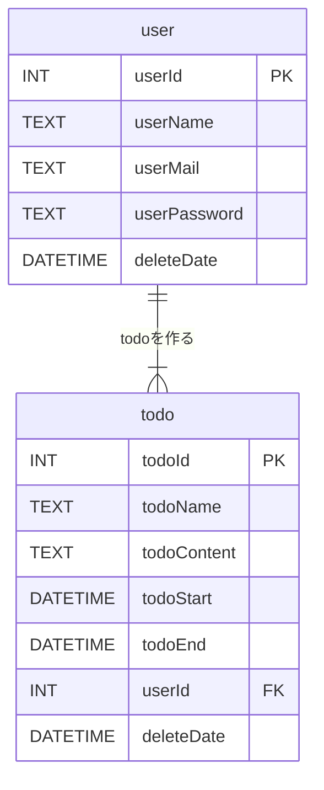
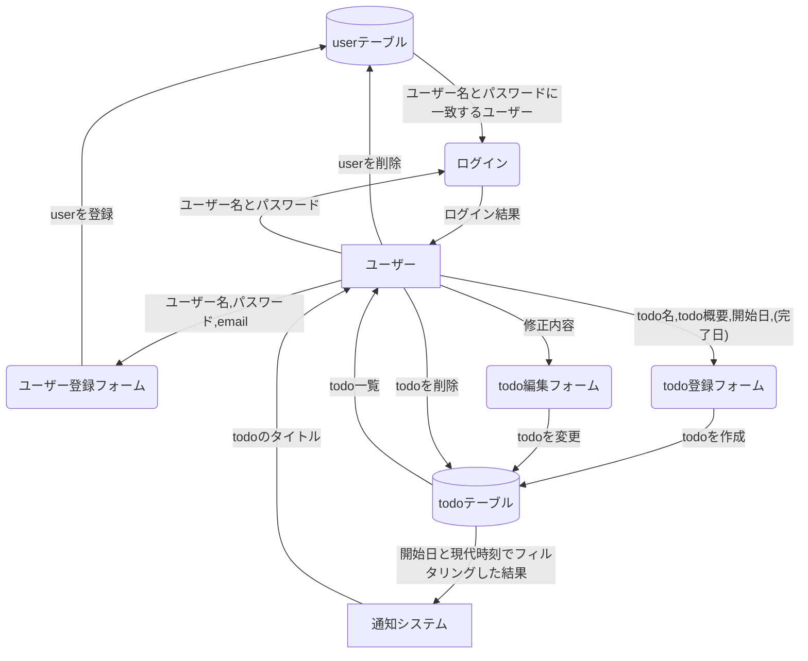

<!--
# 情報整理スペース
## 参考資料
- https://qiita.com/syantien/items/9a8a7cbaeca2be3ef0d7
- https://qiita.com/Saku731/items/741fcf0f40dd989ee4f8
- github copilot

## 5W1H
- Who
  開発: 自分
  使用者: 自分
- What
  todoが管理できるアプリケーションを
- When
  9月までに
- Where
  ログインからtodo表示、検索、追加、削除まで
  フロントエンドからバックエンドまで
  ドキュメントは仕様とインターフェイスまで　言語は未設定
- Why
  ウォーターフローモデルに乗っ取った開発を行い、モデルを身につけたいから
  資料の書き方を身につけたいから
  様々な言語で最初に作るアプリケーションを定義したいから
- How
  UIはreactやvue、swiftUIの基本的なコンポーネントで実現する。
  APIはREST APIを用いる。
  サーバー側はサーバー側のフレームワークを使用、もしくは自力
  DBはSQL系
-->

# 要件定義

このドキュメントでは、My Todo Apps の要件定義を行います。

# 概要

## システム構成図

## 背景

このシステムの目標は、たくさんの言語に触れながら実際に動作するアプリケーションを開発することです。  
なぜなら、自分自身のアプリケーション開発歴が浅く、言語への知識が偏っているからです。  
開発者の日記は、言語の理解とは null 安全性や、オブジェクト指向など言語文化の理解と考えていて、複数の言語をそれぞれ使い、文化の違いなどを理解することで、様々なユースケースに対応できるようになると考えています。  
そのため、フロントエンドとバックエンドを分けて開発すること、フロントエンドは複数のプラットフォームに対応させて開発を行うことが
このプロジェクトの目標であり、背景です。

## 用語定義

| 用語             | 定義                                                                                       |
| ---------------- | ------------------------------------------------------------------------------------------ |
| インターフェイス | システム同士やシステムの人間での情報をやりとりする部分です。入出力部とも                   |
| UI               | UserInterface(UI)は、ユーザーが直接操作できるインターフェイスです                          |
| API              | Application Programming Interface(API)は、異なるシステム同士で使われるインターフェイスです |
| REST API         | API に HTTP(S)通信を用いる、API の規格の一つです                                           |
| チケット (token) | ログイン後に、API と通信時にユーザーを識別するための番号のこと                             |

# 業務要件

業務システムではないため省略

# 機能要件

## 機能一覧

| 機能 ID | 機能名                     | 大分類                                       | 中分類                                   | 説明                                                           |
| ------- | -------------------------- | -------------------------------------------- | ---------------------------------------- | -------------------------------------------------------------- |
| U1-1    | ユーザー登録               | ユーザー管理 | 新規登録 | ユーザーはアカウントを作成できる                               |
| U1-2    | ユーザー削除               | ユーザー管理 | 削除      | ユーザーはアカウントを削除できる                               |
| U1-3    | ユーザー pw 変更           | ユーザー管理 | 編集    | ユーザーは、パスワードを変更できる                             |
| U1-4    | ユーザー通知登録           | ユーザー管理 | 編集    | ユーザーは、通知機能を有効化/無効化できる                      |
| U2-1    | ログイン                   | ユーザー管理 | 照合   | アカウントを持つユーザーは、システムにログインできる           |
| T1-1    | todo 追加                  | todo 管理   | 新規登録 | ユーザーは、todo を作成できる                                  |
| T1-2    | todo 削除                  | todo 管理   | 削除      | ユーザーは、todo を削除できる                                  |
| T1-3    | todo 編集                  | todo 管理   | 編集    | ユーザーは、todo を編集できる                                  |
| T2-1    | todo 一覧表示              | todo 管理   | 照合   | ユーザーは、登録済みの todo を一覧状に確認できる               |
| T2-2    | todo フィルタリング/ソート | todo 管理   | 照合   | ユーザーは、todo をフィルタリング/ソートしながら一覧表示できる |
| T2-3    | todo 検索                  | todo 管理   | 照合   | ユーザーは、todo を検索できる                                  |

## 画面一覧

| 画面 ID | 画面名           | 説明                                           |
| ------- | ---------------- | ---------------------------------------------- |
| SU1-1   | ログイン画面     | システムにログインするための画面               |
| SU1-2   | ユーザー新規登録 | システムにアカウントを作成するための画面       |
| SU2-1   | 設定画面         | ユーザー情報の変更、アカウント削除ができる画面 |
| ST1-1   | todo 一覧画面    | todo を一覧表示、削除できる確認できる画面      |
| ST1-2   | todo 登録画面    | todo を追加するための画面                      |
| ST1-3   | todo 編集画面    | todo を編集するための画面                      |

## データベース

### user テーブル

| 項目名        | 項目名(データ上) | 型       | 制約                               |
| ------------- | ---------------- | -------- | ---------------------------------- |
| ユーザー ID   | userId           | INT      | 主キー, 連番                       |
| ユーザー名    | userName         | TEXT     | 必須                               |
| ユーザー mail | userMail         | TEXT     | メールアドレスのフォーマットで制約 |
| ユーザー pw   | userPassword     | TEXT     | 必要, 12 文字以上                  |
| 削除日        | deleteDate       | DATETIME |                                    |

### todo テーブル

| 項目名       | 項目名(データ上) | 型       | 制約                                |
| ------------ | ---------------- | -------- | ----------------------------------- |
| todoID       | todoId           | INT      | 主キー,連番                         |
| todo 名      | todoName         | TEXT     | 必要                                |
| todo 概要    | todoContent      | TEXT     |                                     |
| 開始日       | todoStart        | Datetime | 必要                                |
| 終了日       | todoEnd          | Datetime |                                     |
| 登録ユーザー | userId           | INT      | 外部キー(user テーブル.ユーザー ID) |
| 削除日       | deleteDate       | DATETIME |                                     |

### ER 図

### データフローについて

### 削除方式

削除するデータ(todo,user)は 3 ヶ月保存とし、管理者が sql を用いて復旧できるものとします。

### ログ

- 保存期間: 1 ヶ月 もしくは 上位 500 件以内
- セキュリティ: ログは管理者のみが閲覧可能とする
- タイムスタンプ: 全てのログにタイムスタンプ (年,月,日 時,分,秒)を残す

| ログ id | ログ名           | ログ種別   | 内容                                       |
| ------- | ---------------- | ---------- | ------------------------------------------ |
| LU1-1   | ユーザー新規登録 | 操作ログ   | アクセス IP, ユーザー Id, ユーザー名       |
| LU2-1   | ログイン成功     | 操作ログ   | アクセス IP, ユーザー Id, ユーザー名       |
| LU2-2   | ログイン失敗     | エラーログ | アクセス IP, 試されたユーザー名            |
| LT1-1   | todo 登録        | 操作ログ   | ユーザー名, todoId, todo 名                |
| LT1-2   | todo 削除        | 操作ログ   | ユーザー名, todoId, todo 名                |
| LT1-3   | todo 編集        | 操作ログ   | ユーザー名, todoId, 旧 todo 名, 新 todo 名 |

## インターフェイス

| インターフェイス id | インターフェイス名 | インターフェイス種別 | 通信方式 | 目的                                   |
| ------------------- | ------------------ | -------------------- | -------- | -------------------------------------- |
| IL1-1               | login              | LoginAPI             | REST     | ユーザー認証を行い、チケットを取得する |
| IU1-1               | useradd            | UserAPI              | REST     | ユーザーの追加                         |
| IU1-2               | usermod            | UserAPI              | REST     | 通知設定を管理する                     |
| IT1-1               | mktodo             | TodoAPI              | REST     | todo の追加                            |
| IT1-2               | rmtodo             | TodoAPI              | REST     | todo の削除                            |
| IT1-3               | mvtodo             | TodoAPI              | REST     | todo の修正                            |

### ユーザー API

### 通知 API

### TodoAPI

# 非機能要件

## ユーザビリティ

ユーザーは 2000 年代生まれの成年( 20 代,30 代 )とし、シンプルさを追求します。
OS で一般的に使われているアイコンにはヒント(アイコンの説明文)を不要で設置できるものとします。

## システムアーキテクチャ

## 規模

## パフォーマンス

## 信頼性

## 拡張性

## 互換性

## 継続性
