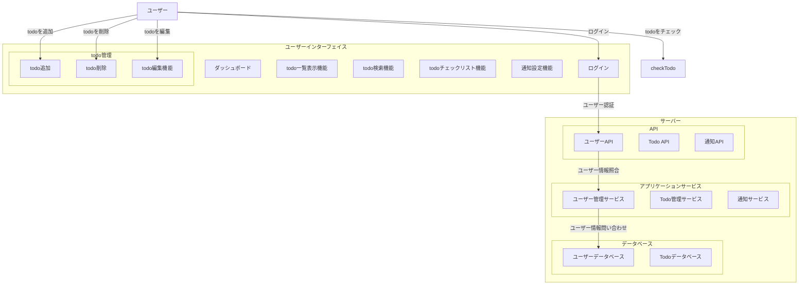

# 要件定義

このドキュメントでは、My Todo Apps の要件定義を行います。

# 機能要件

1. **ユーザー登録**: ユーザーはアカウントを作成し、ログインできる。
2. **タスク管理**: ユーザーはタスクを追加、編集、削除できる。
3. **タスクのステータス管理**: タスクは「未着手」「進行中」「完了」のステータスを持ち、
   ユーザーはこれを変更できる。
4. **期限設定**: タスクには期限を設定でき、期限が近づくと通知される。
5. **優先度設定**: タスクには「低」「中」「高」の優先度を設定できる。
6. **検索機能**: ユーザーはタスクをキーワードで検索できる。
7. **フィルタリング機能**: ユーザーはステータスや優先度でタスクをフィルタリングできる。
8. **ソート機能**: タスクを期限や優先度でソートできる。
9. **ダークモード**: ユーザーはダークモードを選択できる。
10. **レスポンシブデザイン**: アプリはスマートフォン、タブレット、およびデスクトップで適切に表示される。
11. **データのバックアップ**: ユーザーはタスクデータをエクスポートし、バックアップできる。

| 要件 ID | 要件名                 | 分類         | 詳細                                                                                 |
| ------- | ---------------------- | ------------ | ------------------------------------------------------------------------------------ |
| R1      | ユーザー登録           | ユーザー管理 | ユーザーはアカウントを作成し、ログインできる。                                       |
| R2      | タスク管理             | タスク管理   | ユーザーはタスクを追加、編集、削除できる。                                           |
| R3      | タスクのステータス管理 | タスク管理   | タスクは「未着手」「進行中」「完了」のステータスを持ち、ユーザーはこれを変更できる。 |

## システム構成図

