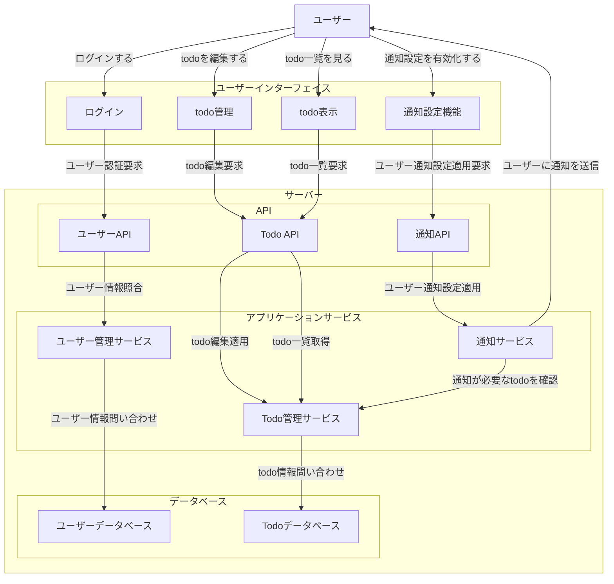

<!--
# 情報整理スペース
## 参考資料
- https://qiita.com/syantien/items/9a8a7cbaeca2be3ef0d7
- https://qiita.com/Saku731/items/741fcf0f40dd989ee4f8
- github copilot

## 5W1H
- Who
  開発: 自分
  使用者: 自分
- What
  todoが管理できるアプリケーションを
- When
  9月までに
- Where
  ログインからtodo表示、検索、追加、削除まで
  フロントエンドからバックエンドまで
  ドキュメントは仕様とインターフェイスまで　言語は未設定
- Why
  ウォーターフローモデルに乗っ取った開発を行い、モデルを身につけたいから
  資料の書き方を身につけたいから
  様々な言語で最初に作るアプリケーションを定義したいから
- How
  UIはreactやvue、swiftUIの基本的なコンポーネントで実現する。
  APIはREST APIを用いる。
  サーバー側はサーバー側のフレームワークを使用、もしくは自力
  DBはSQL系
-->

# 要件定義

このドキュメントでは、My Todo Apps の要件定義を行います。

# 概要

## システム構成図

<!--
オブジェクトA -> オブジェクトB は、ステートレスで考えてるので、
オブジェクトAからオブジェクトBに何かを送り、オブジェクトBからオブジェクトAに対して何かしらの返答をもらう　ところまでセットとなってる。
 -->

## 背景

## 用語定義

# 業務要件

## 業務フロー

## スケール

## スケジュール

## 指標

## スコープ

# 機能要件

## 機能一覧

1. **ユーザー登録**: ユーザーはアカウントを作成し、ログインできる。
2. **タスク管理**: ユーザーはタスクを追加、編集、削除できる。
3. **タスクのステータス管理**: タスクは「未着手」「進行中」「完了」のステータスを持ち、
   ユーザーはこれを変更できる。
4. **期限設定**: タスクには期限を設定でき、期限が近づくと通知される。
5. **優先度設定**: タスクには「低」「中」「高」の優先度を設定できる。
6. **検索機能**: ユーザーはタスクをキーワードで検索できる。
7. **フィルタリング機能**: ユーザーはステータスや優先度でタスクをフィルタリングできる。
8. **ソート機能**: タスクを期限や優先度でソートできる。
9. **ダークモード**: ユーザーはダークモードを選択できる。
10. **レスポンシブデザイン**: アプリはスマートフォン、タブレット、およびデスクトップで適切に表示される。
11. **データのバックアップ**: ユーザーはタスクデータをエクスポートし、バックアップできる。

| 要件 ID | 要件名                 | 分類         | 詳細                                                                                 |
| ------- | ---------------------- | ------------ | ------------------------------------------------------------------------------------ |
| R1      | ユーザー登録           | ユーザー管理 | ユーザーはアカウントを作成し、ログインできる。                                       |
| R2      | タスク管理             | タスク管理   | ユーザーはタスクを追加、編集、削除できる。                                           |
| R3      | タスクのステータス管理 | タスク管理   | タスクは「未着手」「進行中」「完了」のステータスを持ち、ユーザーはこれを変更できる。 |

## 画面一覧

## データベース

## インターフェイス

# 非機能要件

## ユーザビリティ

## システムアーキテクチャ

## 規模

## パフォーマンス

## 信頼性

## 拡張性

## 互換性

## 継続性
