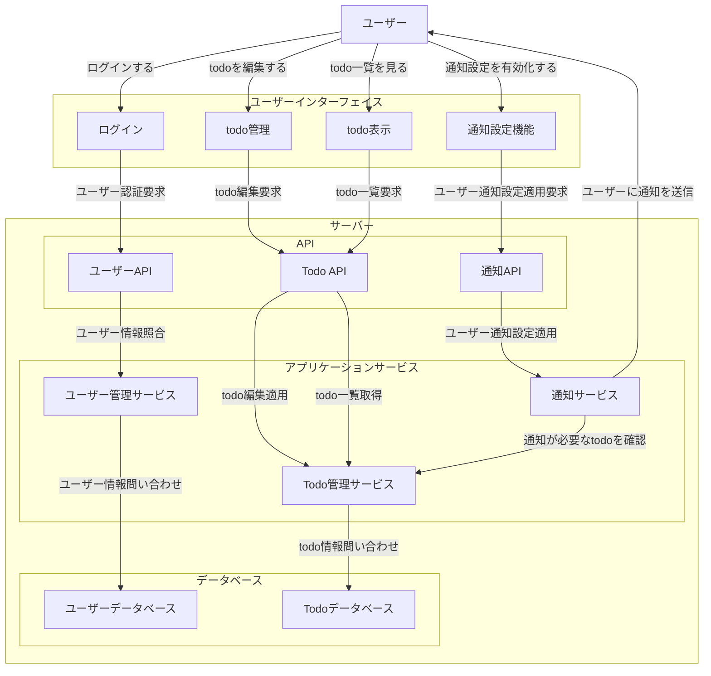

<!--
# 情報整理スペース
## 参考資料
- https://qiita.com/syantien/items/9a8a7cbaeca2be3ef0d7
- https://qiita.com/Saku731/items/741fcf0f40dd989ee4f8
- github copilot

## 5W1H
- Who
  開発: 自分
  使用者: 自分
- What
  todoが管理できるアプリケーションを
- When
  9月までに
- Where
  ログインからtodo表示、検索、追加、削除まで
  フロントエンドからバックエンドまで
  ドキュメントは仕様とインターフェイスまで　言語は未設定
- Why
  ウォーターフローモデルに乗っ取った開発を行い、モデルを身につけたいから
  資料の書き方を身につけたいから
  様々な言語で最初に作るアプリケーションを定義したいから
- How
  UIはreactやvue、swiftUIの基本的なコンポーネントで実現する。
  APIはREST APIを用いる。
  サーバー側はサーバー側のフレームワークを使用、もしくは自力
  DBはSQL系
-->

# 要件定義

このドキュメントでは、My Todo Apps の要件定義を行います。

# 概要

## システム構成図

<!--
オブジェクトA -> オブジェクトB は、ステートレスで考えてるので、
オブジェクトAからオブジェクトBに何かを送り、オブジェクトBからオブジェクトAに対して何かしらの返答をもらう　ところまでセットとなってる。
 -->

## 背景

このシステムの目標は、たくさんの言語に触れながら実際に動作するアプリケーションを開発することです。  
なぜなら、自分自身のアプリケーション開発歴が浅く、言語への知識が偏っているからです。  
開発者の日記は、言語の理解とは null 安全性や、オブジェクト指向など言語文化の理解と考えていて、複数の言語をそれぞれ使い、文化の違いなどを理解することで、様々なユースケースに対応できるようになると考えています。  
そのため、フロントエンドとバックエンドを分けて開発すること、フロントエンドは複数のプラットフォームに対応させて開発を行うことが
このプロジェクトの目標であり、背景です。

## 用語定義

| 用語             | 定義                                                                                       |
| ---------------- | ------------------------------------------------------------------------------------------ |
| インターフェイス | システム同士やシステムの人間での情報をやりとりする部分です。入出力部とも                   |
| UI               | UserInterface(UI)は、ユーザーが直接操作できるインターフェイスです                          |
| API              | Application Programming Interface(API)は、異なるシステム同士で使われるインターフェイスです |
| REST API         | API に HTTP(S)通信を用いる、API の規格の一つです                                           |

# 業務要件

業務システムではないため省略

# 機能要件

## 機能一覧

<!-- 1. **ユーザー登録**: ユーザーはアカウントを作成し、ログインできる。
2. **タスク管理**: ユーザーはタスクを追加、編集、削除できる。
3. **タスクのステータス管理**: タスクは「未着手」「進行中」「完了」のステータスを持ち、
   ユーザーはこれを変更できる。
4. **期限設定**: タスクには期限を設定でき、期限が近づくと通知される。
5. **優先度設定**: タスクには「低」「中」「高」の優先度を設定できる。
6. **検索機能**: ユーザーはタスクをキーワードで検索できる。
7. **フィルタリング機能**: ユーザーはステータスや優先度でタスクをフィルタリングできる。
8. **ソート機能**: タスクを期限や優先度でソートできる。
9. **ダークモード**: ユーザーはダークモードを選択できる。
10. **レスポンシブデザイン**: アプリはスマートフォン、タブレット、およびデスクトップで適切に表示される。
11. **データのバックアップ**: ユーザーはタスクデータをエクスポートし、バックアップできる。 -->

| 機能 ID | 機能名              | 大分類       | 中分類   | 説明                                                    |
| ------- | ------------------- | ------------ | -------- | ------------------------------------------------------- |
| U1-1    | ユーザー登録        | ユーザー管理 | 新規登録 | ユーザーはアカウントを作成できる                        |
| U1-2    | ユーザー削除        | ユーザー管理 | 削除     | ユーザーはアカウントを削除できる                        |
| U1-3    | ユーザー pw 変更    | ユーザー管理 | 編集     | ユーザーは、パスワードを変更できる                      |
| U1-4    | ユーザー通知登録    | ユーザー管理 | 編集     | ユーザーは、通知機能を有効化/無効化できる               |
| U2-1    | ログイン            | ユーザー管理 | 照合     | アカウントを持つユーザーは、システムにログインできる    |
| T1-1    | todo 追加           | todo 管理    | 新規登録 | ユーザーは、todo を作成できる                           |
| T1-2    | todo 削除           | todo 管理    | 削除     | ユーザーは、todo を削除できる                           |
| T1-3    | todo 編集           | todo 管理    | 編集     | ユーザーは、todo を編集できる                           |
| T2-1    | todo 一覧表示       | todo 管理    | 照合     | ユーザーは、登録済みの todo を一覧状に確認できる        |
| T2-2    | todo フィルタリング | todo 管理    | 照合     | ユーザーは、todo をフィルタリングしながら一覧表示できる |
| T2-3    | todo 検索           | todo 管理    | 照合     | ユーザーは、todo を検索できる                           |

## 画面一覧

## データベース

## インターフェイス

# 非機能要件

## ユーザビリティ

## システムアーキテクチャ

## 規模

## パフォーマンス

## 信頼性

## 拡張性

## 互換性

## 継続性
